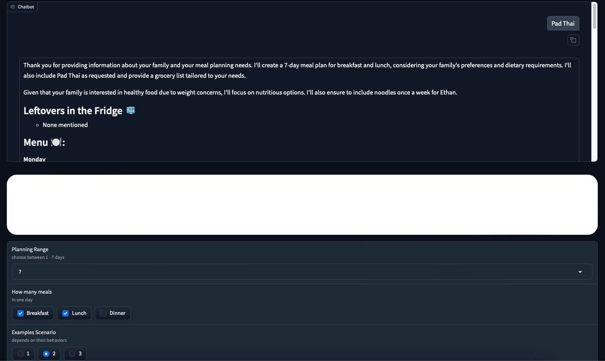

# Hackathon-2024-Integrate
This project addresses food waste at its largest source: households. Our solution focuses on:

### Key Features

* **Smart Recipe Generation**: Creates personalized recipes from leftover ingredients in your refrigerator, tailored to your family's preferences and eating habits.

* **Portion Control Optimization**: Calculates precise portions based on household size to prevent over or under-purchasing of ingredients.

* **Meal Planning Assistant**: Helps users plan their meals efficiently to minimize waste.

* **Waste Value Information System**: When food waste occurs, the system:
    * Provides real-time waste market values from our database
    * Shows potential economic value of waste materials
    * Offers recommendations for waste utilization based on current market data

Our goal is to transform household food management by making it more sustainable, cost-effective, and environmentally conscious.

### Step 1: Set Up environment
1. Create Virsual Environment
```
python3 -m venv env
```
2. Activate Virtual Environment
```
source env/bin/activate
```
3. Install Library
```
pip install -r requirements.txt
```

### Step 2: Create Vector Database and Store Data
1. Store Family Scenario
```
python3 createDatabase/createDatabaseFamily.py
```
2. Store Waste Information
```
python3 createDatabase/createDatabase_Waste.py
```

### Step 3: Calibrate Camera
```
python3 integrate/calibrate-cam.py
```
After running this command, **wait approximately 10 seconds** and then press Ctrl + C or Press the `Q` key on your keyboard.

### Step 4: Run Application
```
python3 main.py
```
After running this command, you will see the UI interface as shown in the image below:

